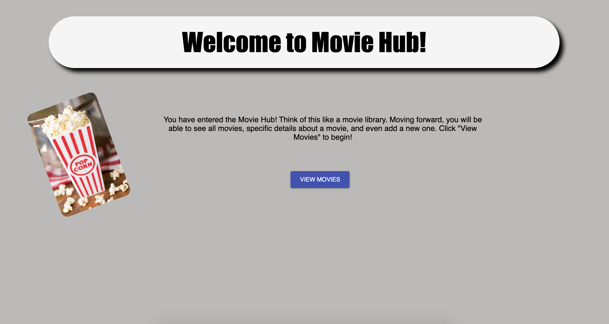
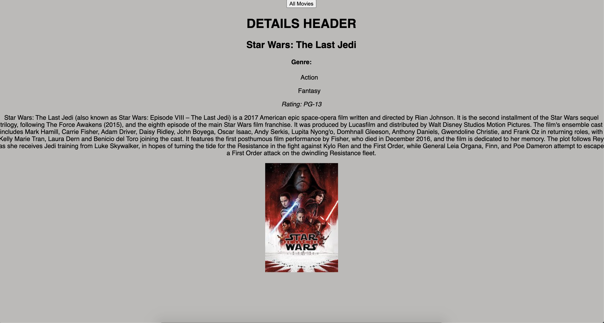

# Movie Hub
_Project is not complete yet_

_Duration: 20 hours_

At my local movie theater they had a problem with how they displayed their movies. It was all done manually on an advertisement board and they wanted a digital way of displaying their movies, as well as a feature to add a new movie. They reached out to me asking if I was able to build this for them. I said definitely!

I built a multi-page web application that allows customers to view movies that are currently being played. They are able to scroll through a list of movie posters and if they see one they like, click the poster to access more details. The movie theater employees have the ability to add a new movie as well!

<!-- complete up to here -->
## Screen Shots

Below is the home landing page.

Below is the details view after a user clicks on a specific movie poster.

### Prerequisites

If you plan to clone and run this application, first install Node.js:

- [Node.js](https://nodejs.org/en/)

## Installation

1. Create a database named `saga_movies_weekend`.
2. The queries in the `data.sql` file are set up to create all the necessary tables and populate the needed data to allow the application to run correctly. The project is built on [Postgres](https://www.postgresql.org/download/), so you will need to make sure to have that installed. We recommend using Postico to run those queries as that was used to create the queries.
3. Open up your editor of choice and run an `npm install`.
4. Run `npm run server` in your terminal.
5. Run `npm run client` in your terminal.
6. The `npm run client` command will open up a new browser tab for you!

## Usage

1. Starting on the home page, click 'View Movies'.
2. Here is the Movie Library view. Clicking 'Add New Movie' will go to another view where you can add a movie. Clicking on a movie poster will go to another view with specific details of that movie.
3. In the add new movie view, once all inputs are filled in and "Save Movie" is clicked, the movie will be added to the library.

## Technologies used

Prime stack -
- CSS
- Node.js
- React.js
- Redux
- Sagas
- Express
- PostgreSQL

## Acknowledgement
Thanks to [Prime Digital Academy](www.primeacademy.io) who equipped and helped me to make this application a reality!

## Support
If you have suggestions or issues, please email me at Hansolo6283@gmail.com